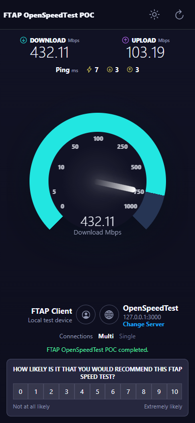
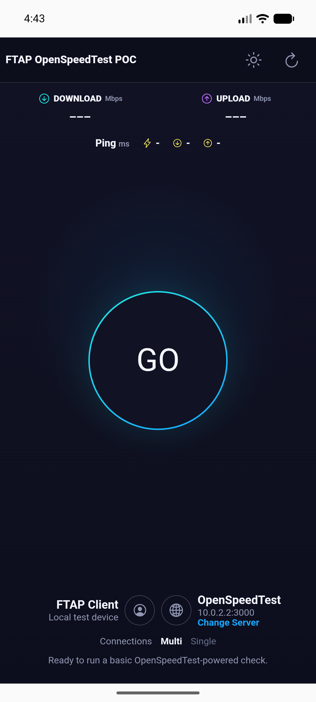
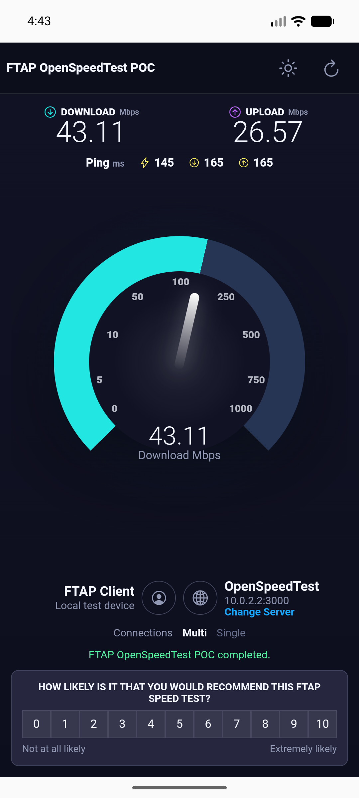
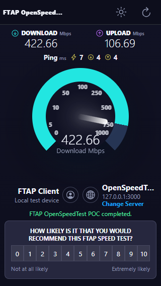
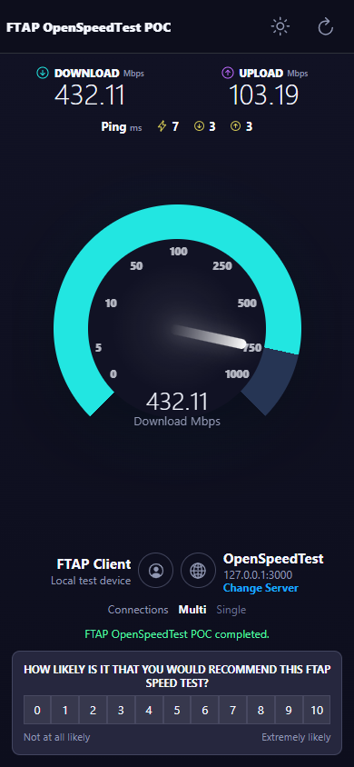
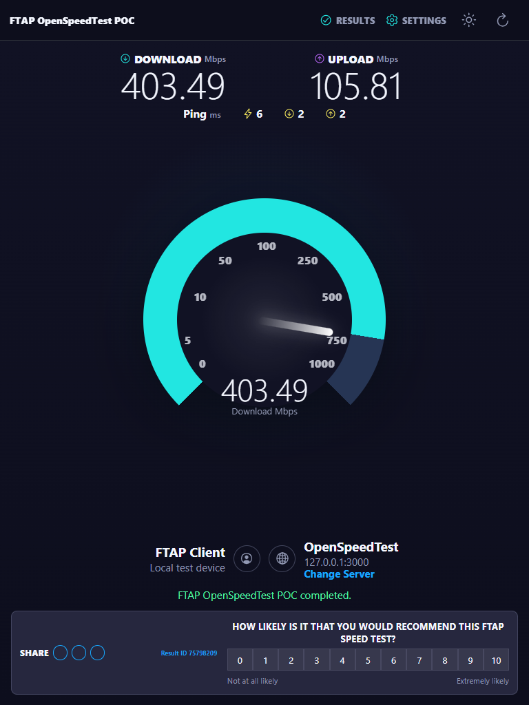
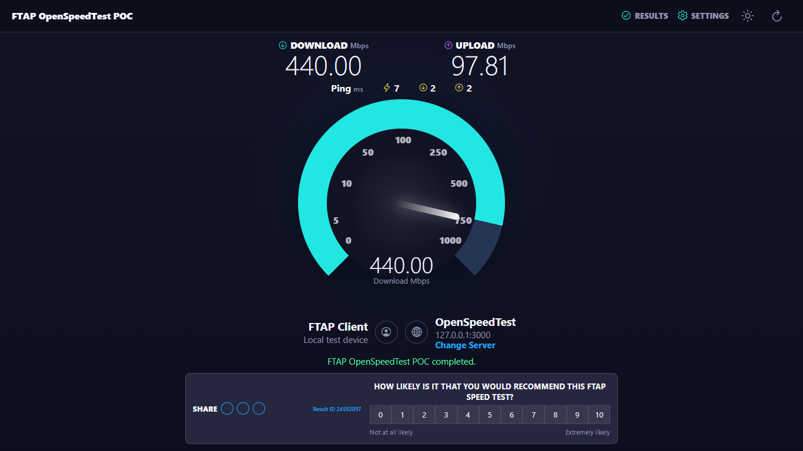
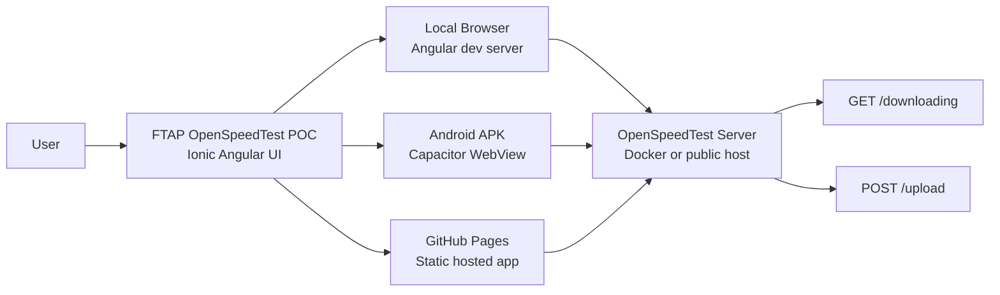
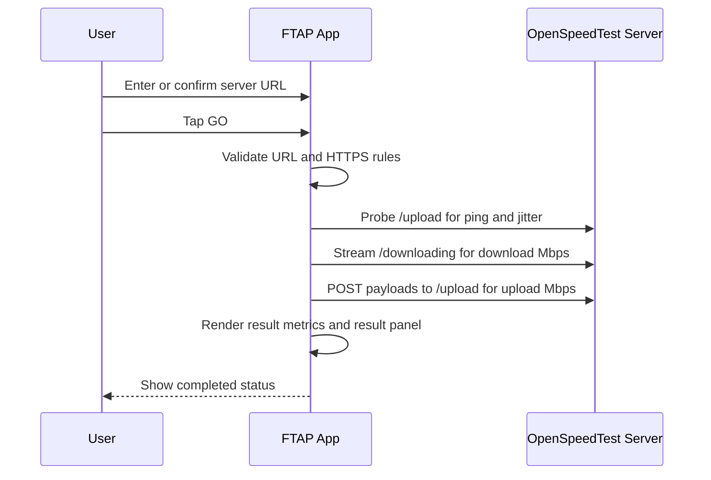
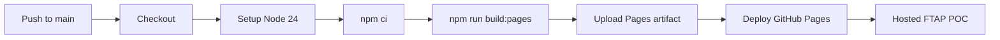

# FTAP OpenSpeedTest POC

FTAP OpenSpeedTest POC is a hybrid mobile proof of concept built with Ionic Angular and Capacitor. It presents a Speedtest-style mobile experience while using the open-source OpenSpeedTest server model for the actual test endpoints.

Open-source reference:

[https://github.com/openspeedtest/Speed-Test](https://github.com/openspeedtest/Speed-Test)

Important: this is not an Ookla product and should not be branded as Ookla. This repository is an FTAP proof of concept that uses OpenSpeedTest-compatible endpoints.

## Live Links

| Item | Link or Path |
| --- | --- |
| GitHub repository | [https://github.com/rgalor-ca/openspeedtest-ftap-poc](https://github.com/rgalor-ca/openspeedtest-ftap-poc) |
| GitHub Pages app | [https://rgalor-ca.github.io/openspeedtest-ftap-poc/](https://rgalor-ca.github.io/openspeedtest-ftap-poc/) |
| Local app | `http://127.0.0.1:4200/` |
| Local OpenSpeedTest server | `http://127.0.0.1:3000/` |
| Android emulator OpenSpeedTest URL | `http://10.0.2.2:3000` |
| Debug APK | `FTAP-OpenSpeedTest-POC-debug.apk` |

## What This POC Includes

- Hybrid app built with Ionic Angular and Capacitor.
- Android debug APK artifact committed in the repository.
- Speedtest-style dark UI with a large GO ring, animated gauge, download/upload metrics, ping/jitter row, server row, status text, result panel, and light/dark toggle.
- Direct OpenSpeedTest endpoint integration:
  - `GET /downloading` for download measurement.
  - `POST /upload` for upload measurement.
  - lightweight `GET /upload` probes for latency.
- Docker Compose server for OpenSpeedTest.
- GitHub Pages deployment for remote UI access.
- One-screen responsive UI validated with no app-level scrolling across tested mobile, tablet, and desktop viewports.
- Editable and saved OpenSpeedTest server URL.
- Start, stop, restart/reload, invalid URL, unreachable server, HTTPS mixed-content, and completed-result states.
- Full documentation with architecture, workflows, edge cases, validation, and troubleshooting.

## Current Screenshots

### Local Browser



### Android Emulator Idle



### Android Emulator Result



### Validated Responsive Views

| Small phone | Phone |
| --- | --- |
|  |  |

| Tablet | Desktop |
| --- | --- |
|  |  |

## High-Level Architecture



## Runtime Workflow



## Tech Stack

| Area | Technology |
| --- | --- |
| Hybrid mobile framework | Ionic Angular |
| Native runtime | Capacitor |
| Web framework | Angular |
| Android project | Capacitor Android and Gradle |
| Speed-test server | OpenSpeedTest Docker image or compatible host |
| Local server | Docker Compose |
| Hosted web app | GitHub Pages |
| Package manager | npm |

## Repository Structure

```text
.
|-- .github/workflows/pages.yml       GitHub Pages deployment workflow
|-- android/                          Capacitor Android project
|-- docs/
|   |-- DOCUMENTATION.md              Full technical and validation documentation
|   `-- images/                       Browser, emulator, and responsive screenshots
|-- public/                           Static web assets
|-- src/                              Ionic Angular application source
|-- capacitor.config.ts               Capacitor app id, name, web dir, and WebView settings
|-- docker-compose.yml                Local OpenSpeedTest Docker server
|-- FTAP-OpenSpeedTest-POC-debug.apk  Debug Android APK artifact
|-- package.json                      Scripts and dependencies
`-- README.md                         Project overview and quick start
```

## Quick Start

1. Install dependencies.

```bash
npm install
```

2. Start the OpenSpeedTest Docker server.

```bash
docker compose up -d
```

3. Confirm the server responds.

```text
http://127.0.0.1:3000/
```

4. Start the Ionic Angular app.

```bash
npm start
```

5. Open the local app.

```text
http://127.0.0.1:4200/
```

6. Use the correct server URL for your environment.

| Environment | Server URL |
| --- | --- |
| Local Chrome on the same computer | `http://127.0.0.1:3000` |
| Android emulator on the same Windows host | `http://10.0.2.2:3000` |
| Physical phone on same Wi-Fi | `http://<host-lan-ip>:3000` |
| GitHub Pages remote user | Public HTTPS OpenSpeedTest server URL |

## Docker Server

The Compose stack is explicitly named `ftap-openspeedtest-poc` so Docker Desktop shows the project with the FTAP POC name.

```yaml
name: ftap-openspeedtest-poc

services:
  openspeedtest:
    image: openspeedtest/latest
    container_name: openspeedtest
    restart: unless-stopped
    ports:
      - '3000:3000'
      - '3001:3001'
```

Useful commands:

```bash
docker compose up -d
docker compose ps
docker compose logs -f
docker compose down
```

## Build Web App

```bash
npm run build
```

Expected output:

```text
dist/ftap-openspeedtest-poc/browser
```

## Build GitHub Pages Version

```bash
npm run build:pages
```

This uses the required GitHub Pages base path:

```text
/openspeedtest-ftap-poc/
```

## Build Android APK

PowerShell:

```powershell
$env:JAVA_HOME='C:\Program Files\Android\Android Studio\jbr'
$env:Path="$env:JAVA_HOME\bin;$env:Path"
npm run build
npx cap sync android
Push-Location android
.\gradlew.bat assembleDebug
Pop-Location
Copy-Item -LiteralPath 'android\app\build\outputs\apk\debug\app-debug.apk' -Destination 'FTAP-OpenSpeedTest-POC-debug.apk' -Force
```

## Install APK On Android Emulator

```powershell
adb install -r FTAP-OpenSpeedTest-POC-debug.apk
adb shell monkey -p com.ftap.openspeedtestpoc -c android.intent.category.LAUNCHER 1
```

Inside the emulator, use:

```text
http://10.0.2.2:3000
```

Why: `127.0.0.1` inside the emulator points to the emulator itself. `10.0.2.2` is Android emulator networking for the Windows host machine.

## GitHub Pages Deployment

GitHub Pages deploys on every push to `main` through `.github/workflows/pages.yml`.



The hosted app is static. It can render remotely from GitHub Pages, but the speed-test server must also be reachable remotely. Because GitHub Pages is HTTPS, use a public HTTPS OpenSpeedTest server URL.

## URL Rules And Edge Cases

| Case | Expected Behavior |
| --- | --- |
| Empty URL | App rejects it and does not start |
| Missing protocol | App rejects it and asks for `http://` or `https://` |
| Unsupported protocol such as `ftp://` | App rejects it |
| Local browser with `127.0.0.1:3000` | Works when Docker server is running locally |
| Android emulator with `127.0.0.1:3000` | Fails because that points to the emulator |
| Android emulator with `10.0.2.2:3000` | Works when Docker server is running on Windows |
| GitHub Pages with private LAN URL | Usually fails for remote users because the URL is not public |
| GitHub Pages with HTTP server | App blocks the start and asks for HTTPS |
| Stop while running | App aborts the active request and returns to stopped state |
| Server without CORS | Browser blocks endpoint requests; host OpenSpeedTest with CORS enabled |

## Validation Summary

Current validation covers:

- Production web build with `npm run build`.
- GitHub Pages build with `npm run build:pages`.
- Docker OpenSpeedTest endpoint health for `/downloading` and `/upload`.
- Local browser full start-to-complete flow using real OpenSpeedTest endpoints.
- Stop/abort behavior while a test is active.
- Responsive completed-result checks at `320x568`, `390x844`, `768x1024`, and `1366x768`.
- Capacitor sync with `npx cap sync android`.
- Android debug APK build with Gradle.
- APK metadata check for package id and app label.
- Emulator install and launch of `com.ftap.openspeedtestpoc/.MainActivity`.
- Emulator packaged-app run against `http://10.0.2.2:3000`.
- Source scan for old naming and branding leftovers.

## Security Notes

The POC intentionally allows local HTTP traffic so Docker, LAN, and emulator testing are straightforward.

Before production:

- Serve the OpenSpeedTest server over HTTPS.
- Restrict Capacitor navigation to trusted domains.
- Remove broad `allowNavigation: ['*']`.
- Sign a release APK with a release keystore.
- Do not distribute the debug APK as a production artifact.

## Full Documentation

Read the detailed documentation for architecture, process flows, diagrams, testing matrix, edge cases, troubleshooting, and release steps:

[docs/DOCUMENTATION.md](docs/DOCUMENTATION.md)
