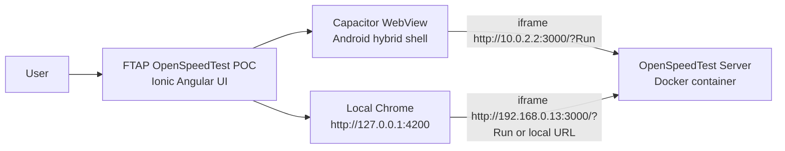
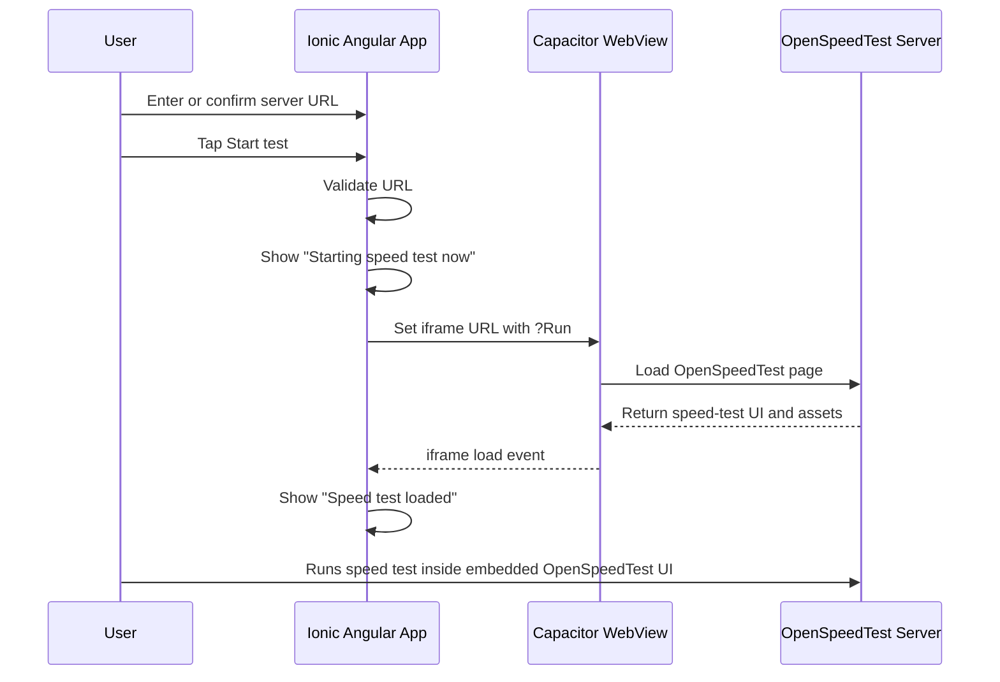

# FTAP OpenSpeedTest POC

FTAP OpenSpeedTest POC is a hybrid mobile proof of concept built with Ionic Angular and Capacitor. It provides a basic speed-test mobile app shell that launches a self-hosted OpenSpeedTest server flow inside the app.

The POC is based on the open-source OpenSpeedTest project:

https://github.com/openspeedtest/Speed-Test

This is not an Ookla product and should not be branded as Ookla. It is an FTAP POC using OpenSpeedTest as the open-source speed-test engine.

## APK

The debug APK is included in this repository:

```text
FTAP-OpenSpeedTest-POC-debug.apk
```

Install it on an Android device or emulator. For the Android emulator on the same Windows machine as the Docker server, use this server URL inside the app:

```text
http://10.0.2.2:3000
```

## What This POC Does

- Runs as a hybrid mobile app using Ionic Angular and Capacitor.
- Loads a self-hosted OpenSpeedTest server.
- Starts the basic OpenSpeedTest flow with the `Run` URL parameter.
- Supports local browser testing through Angular dev server.
- Supports Android emulator testing through Capacitor.
- Shows clear status messages such as starting, loading, loaded, stopped, and error.
- Allows changing and saving the OpenSpeedTest server URL.
- Allows stopping and restarting the embedded test.

## Tech Stack

| Area | Technology |
| --- | --- |
| Mobile framework | Ionic Angular |
| Hybrid runtime | Capacitor |
| Web framework | Angular |
| Android shell | Capacitor Android |
| Speed-test engine | OpenSpeedTest Docker server |
| Local backend | Docker Compose |
| Android build | Gradle |

## Current Local Browser Screenshot


The screenshot above shows the local browser build loading the FTAP-branded shell and rendering the OpenSpeedTest speed-test UI inside the app frame.


The screenshot above shows the installed APK running in the Android emulator with the OpenSpeedTest flow loaded through `http://10.0.2.2:3000`.

## High-Level Architecture



## Runtime Flow



## Repository Structure

```text
.
├── android/                         Capacitor Android project
├── docs/
│   └── DOCUMENTATION.md             Full technical documentation and validation guide
├── public/                          Static web assets
├── src/                             Ionic Angular application source
├── capacitor.config.ts              Capacitor app id, app name, web dir, Android WebView settings
├── docker-compose.yml               Local OpenSpeedTest Docker server
├── FTAP-OpenSpeedTest-POC-debug.apk Debug APK artifact
├── package.json                     Node scripts and dependencies
└── README.md                        Project overview and quick start
```

## Prerequisites

- Node.js and npm
- Docker Desktop
- Android Studio or Android SDK for APK builds
- Java from Android Studio JBR, or a compatible JDK
- Android emulator or physical Android device

## Start The OpenSpeedTest Server

Use Docker Compose:

```bash
docker compose up -d
```

Equivalent direct Docker command:

```bash
docker run --restart=unless-stopped --name openspeedtest -d -p 3000:3000 -p 3001:3001 openspeedtest/latest
```

Confirm the server is reachable:

```text
http://127.0.0.1:3000
```

## Run Locally In Browser

Install dependencies:

```bash
npm install
```

Start the Ionic Angular app:

```bash
npm start
```

Open:

```text
http://127.0.0.1:4200
```

For local browser testing on the same machine, use the LAN server URL already configured in the app, or replace it with:

```text
http://127.0.0.1:3000
```

For Android emulator testing, use:

```text
http://10.0.2.2:3000
```

## Build The Web App

```bash
npm run build
```

Expected output:

```text
dist/ftap-openspeedtest-poc/browser
```

## Sync Capacitor Android

```bash
npx cap sync android
```

This copies the Angular build output into the Android project and regenerates Capacitor assets.

## Build The Android APK

From PowerShell on this machine:

```powershell
$env:JAVA_HOME='C:\Program Files\Android\Android Studio\jbr'
$env:Path="$env:JAVA_HOME\bin;$env:Path"
Push-Location android
.\gradlew.bat assembleDebug
Pop-Location
Copy-Item -LiteralPath 'android\app\build\outputs\apk\debug\app-debug.apk' -Destination 'FTAP-OpenSpeedTest-POC-debug.apk' -Force
```

## Android Emulator Install

```powershell
adb install -r FTAP-OpenSpeedTest-POC-debug.apk
adb shell monkey -p com.ftap.openspeedtestpoc -c android.intent.category.LAUNCHER 1
```

If the OpenSpeedTest server is running on the Windows host machine, the emulator must use:

```text
http://10.0.2.2:3000
```

`127.0.0.1` inside the Android emulator points to the emulator itself, not the Windows host.

## Important Capacitor Settings

The POC enables HTTP testing for local LAN and emulator use:

```ts
android: {
  allowMixedContent: true,
},
server: {
  cleartext: true,
  allowNavigation: ['*'],
},
```

The Android manifest also allows cleartext traffic:

```xml
android:usesCleartextTraffic="true"
```

These settings are appropriate for a local POC. For production, use HTTPS and restrict `allowNavigation` to the exact trusted server domain.

## Validation Summary

The current build was validated with:

- Angular production build: `npm run build`
- Capacitor sync: `npx cap sync android`
- Android debug APK build: `.\gradlew.bat assembleDebug`
- Local browser title check at `http://127.0.0.1:4200`
- Source scan for old branding and old package identifiers
- Android package id updated to `com.ftap.openspeedtestpoc`
- APK generated as `FTAP-OpenSpeedTest-POC-debug.apk`

## Full Documentation

For detailed architecture, process flows, diagrams, edge cases, testing matrix, troubleshooting, and release steps, read:

[docs/DOCUMENTATION.md](docs/DOCUMENTATION.md)
