# FTAP OpenSpeedTest POC Documentation

This document is the detailed technical guide for the FTAP OpenSpeedTest POC. It explains the architecture, setup, runtime behavior, endpoint usage, build process, deployment flow, validation strategy, edge cases, troubleshooting, and production considerations.

## 1. Project Purpose

FTAP OpenSpeedTest POC is a hybrid mobile proof of concept for running a basic speed test through an OpenSpeedTest-compatible server.

The current implementation uses a native Ionic Angular interface instead of embedding the upstream test page as the primary experience. The app measures against the same server model used by OpenSpeedTest:

- `GET /downloading` for download throughput.
- `POST /upload` for upload throughput.
- lightweight `GET /upload` probes for ping and jitter.

The app provides:

- A Speedtest-style FTAP mobile UI.
- A native Android package through Capacitor.
- A local browser development workflow.
- A Docker-based OpenSpeedTest server workflow.
- A hosted GitHub Pages shell for remote access.
- Server URL management.
- Immediate and visible status feedback.
- Dark mode by default with a light/dark toggle.
- One-screen responsive UI with no app-level scrolling across validated viewports.

The upstream reference is:

[https://github.com/openspeedtest/Speed-Test](https://github.com/openspeedtest/Speed-Test)

This is not an Ookla product. The correct product name in this repository is `FTAP OpenSpeedTest POC`.

## 2. Current Visuals

### Local Browser Screenshot


### Android Emulator Idle Screenshot


### Android Emulator Result Screenshot


### Responsive Validation Screenshots

| Small phone `320x568` | Phone `390x844` |
| --- | --- |
|  |  |

| Tablet `768x1024` | Desktop `1366x768` |
| --- | --- |
|  |  |

## 3. System Context

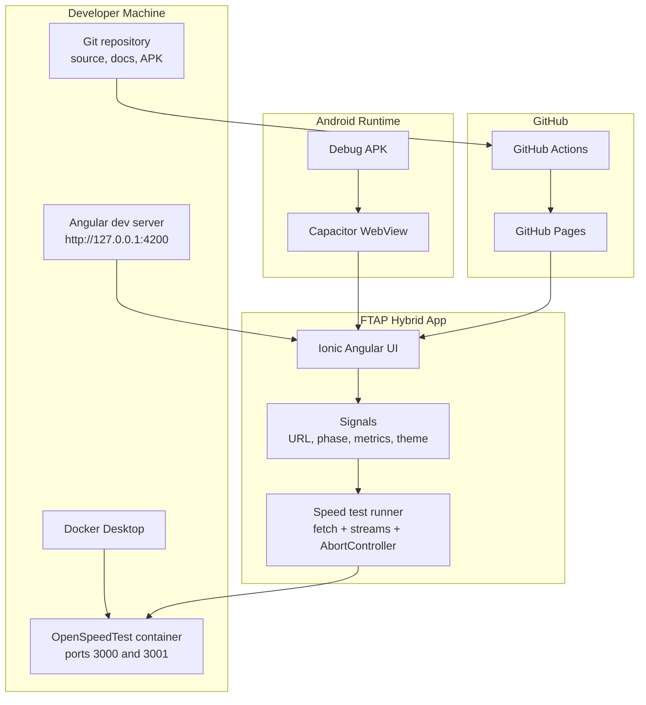

## 4. Component Architecture

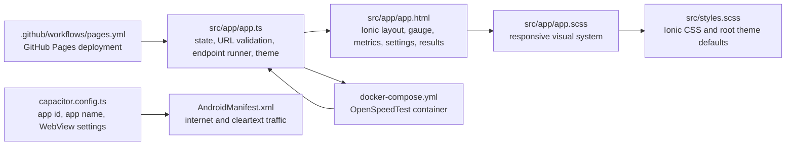

| File | Responsibility |
| --- | --- |
| `src/app/app.ts` | Holds app state, URL validation, saved server URL, theme mode, start/stop/reload behavior, ping/download/upload measurement, and error handling |
| `src/app/app.html` | Defines the Ionic UI, toolbar, settings panel, metrics row, GO ring, gauge, server strip, status text, and results panel |
| `src/app/app.scss` | Provides dark/light themes, Speedtest-style visual treatment, one-screen responsive layout, gauge styling, and overflow control |
| `src/styles.scss` | Imports Ionic CSS and defines baseline root styling |
| `capacitor.config.ts` | Defines Capacitor app id/name, web output path, and local HTTP WebView settings |
| `android/app/src/main/AndroidManifest.xml` | Enables internet permission and cleartext traffic for local HTTP POC testing |
| `docker-compose.yml` | Runs the local OpenSpeedTest server and names the Docker stack `ftap-openspeedtest-poc` |
| `.github/workflows/pages.yml` | Builds and deploys the static web app to GitHub Pages |

## 5. Runtime Flow

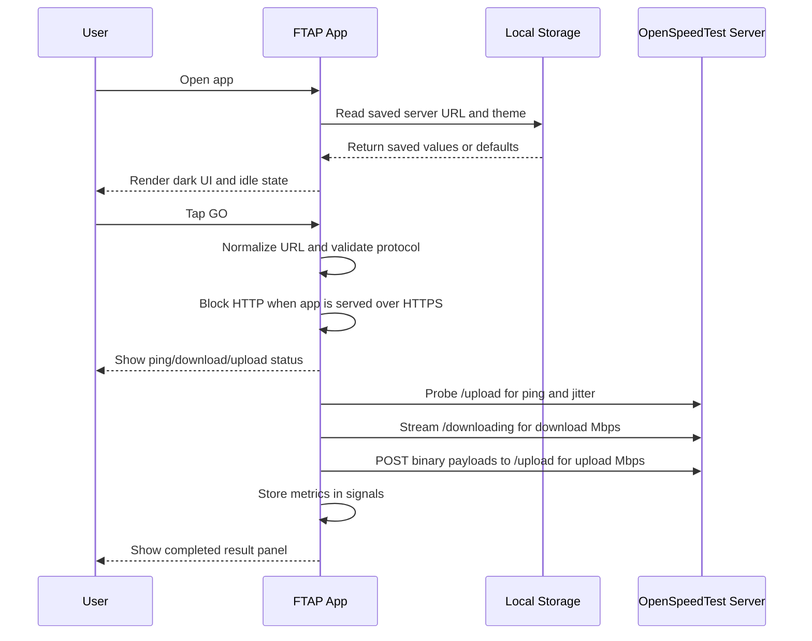

## 6. App State Machine

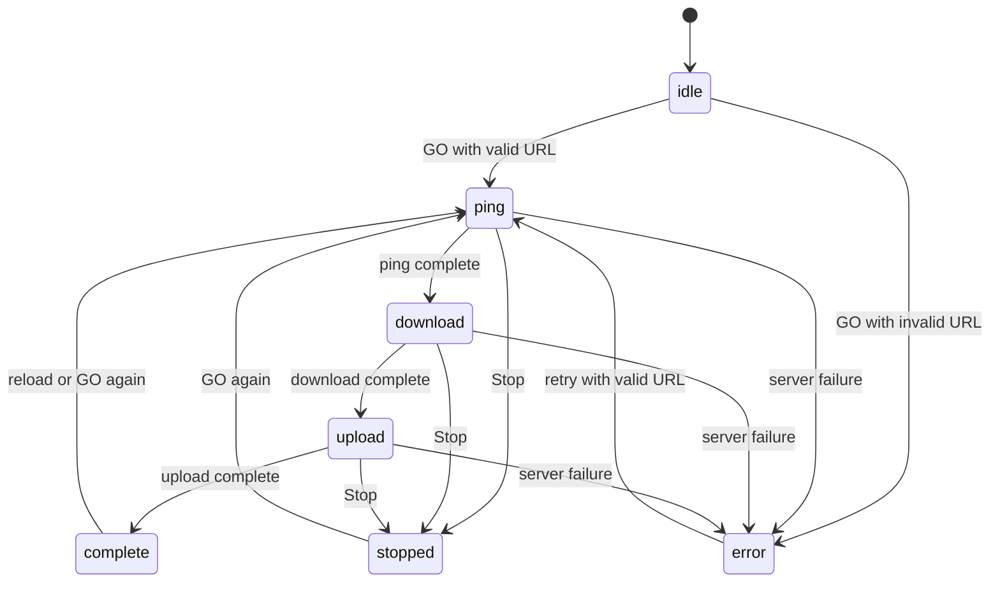

| State | User-Facing Meaning |
| --- | --- |
| `idle` | No test is active |
| `ping` | The app is checking latency |
| `download` | The app is measuring download throughput |
| `upload` | The app is measuring upload throughput |
| `complete` | Download, upload, ping, and jitter have results |
| `stopped` | The user stopped the active run |
| `error` | URL validation failed or a server/network request failed |

## 7. Endpoint Measurement Design

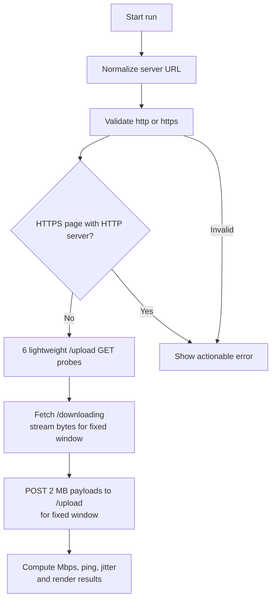

Implementation notes:

- Download speed is computed from streamed response bytes over the elapsed time window.
- Upload speed is computed from repeated binary POST payloads over the elapsed time window.
- Ping is the average of multiple lightweight probes.
- Jitter is the average absolute delta between adjacent probe durations.
- `AbortController` is used to stop active requests.
- Metrics are rounded for display because this is a POC UI, not a certification-grade benchmark.

## 8. URL Decision Tree

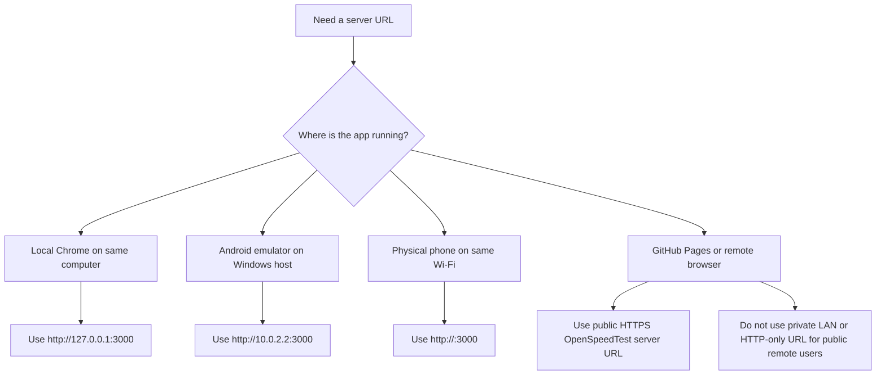

## 9. Network Rules

| Runtime | Correct URL | Why |
| --- | --- | --- |
| Windows Chrome, Docker on same Windows host | `http://127.0.0.1:3000` | Chrome resolves localhost to Windows |
| Android emulator, Docker on Windows host | `http://10.0.2.2:3000` | Android emulator maps `10.0.2.2` to the host machine |
| Physical Android phone, Docker on Windows host | `http://<host-lan-ip>:3000` | The phone is a separate LAN device |
| GitHub Pages | Public HTTPS URL | Pages is HTTPS and remote users cannot reach private LAN hosts |

Incorrect examples:

| URL | Problem |
| --- | --- |
| `127.0.0.1:3000` | Missing protocol |
| `ftp://example.com` | Unsupported protocol |
| `http://127.0.0.1:3000` in emulator | Points to the emulator, not Windows |
| `http://192.168.x.x:3000` from a remote public user | Private LAN address is not internet routable |
| `http://public-server.example.com` from GitHub Pages | Blocked by the app because HTTPS pages should use HTTPS test servers |

## 10. Docker Server Flow

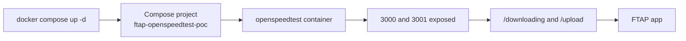

Docker Compose:

```yaml
name: ftap-openspeedtest-poc

services:
  openspeedtest:
    image: openspeedtest/latest
    container_name: openspeedtest
    restart: unless-stopped
    ports:
      - '3000:3000'
      - '3001:3001'
```

Validate:

```bash
docker compose ps
```

Expected local server:

```text
http://127.0.0.1:3000/
```

Endpoint probes:

```powershell
Invoke-WebRequest -UseBasicParsing -Method Head -Uri http://127.0.0.1:3000/downloading?probe=1
Invoke-WebRequest -UseBasicParsing -Method Post -Uri http://127.0.0.1:3000/upload?probe=1 -Body 'probe'
```

## 11. GitHub Pages Deployment Flow

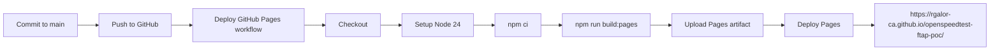

Why `build:pages` exists:

GitHub Pages hosts the app under the repository path:

```text
/openspeedtest-ftap-poc/
```

The Pages build sets this base path so Angular assets resolve correctly:

```bash
npm run build:pages
```

## 12. Local Development Setup

1. Install dependencies.

```bash
npm install
```

2. Start Docker Desktop.

3. Start the OpenSpeedTest server.

```bash
docker compose up -d
```

4. Validate Docker.

```bash
docker compose ps
```

5. Validate OpenSpeedTest in a browser.

```text
http://127.0.0.1:3000/
```

6. Start the Angular dev server.

```bash
npm start
```

7. Open the local app.

```text
http://127.0.0.1:4200/
```

8. In local Chrome, use:

```text
http://127.0.0.1:3000
```

9. Tap `GO`.

10. Confirm the status moves through ping, download, upload, and completed.

## 13. Android Emulator Setup

1. Build web assets.

```bash
npm run build
```

2. Sync Capacitor.

```bash
npx cap sync android
```

3. Build the APK.

```powershell
$env:JAVA_HOME='C:\Program Files\Android\Android Studio\jbr'
$env:Path="$env:JAVA_HOME\bin;$env:Path"
Push-Location android
.\gradlew.bat assembleDebug
Pop-Location
```

4. Copy the debug APK to the repository root.

```powershell
Copy-Item -LiteralPath 'android\app\build\outputs\apk\debug\app-debug.apk' -Destination 'FTAP-OpenSpeedTest-POC-debug.apk' -Force
```

5. Install and launch.

```powershell
adb install -r FTAP-OpenSpeedTest-POC-debug.apk
adb shell monkey -p com.ftap.openspeedtestpoc -c android.intent.category.LAUNCHER 1
```

6. In the app, use:

```text
http://10.0.2.2:3000
```

## 14. Build And Release Process

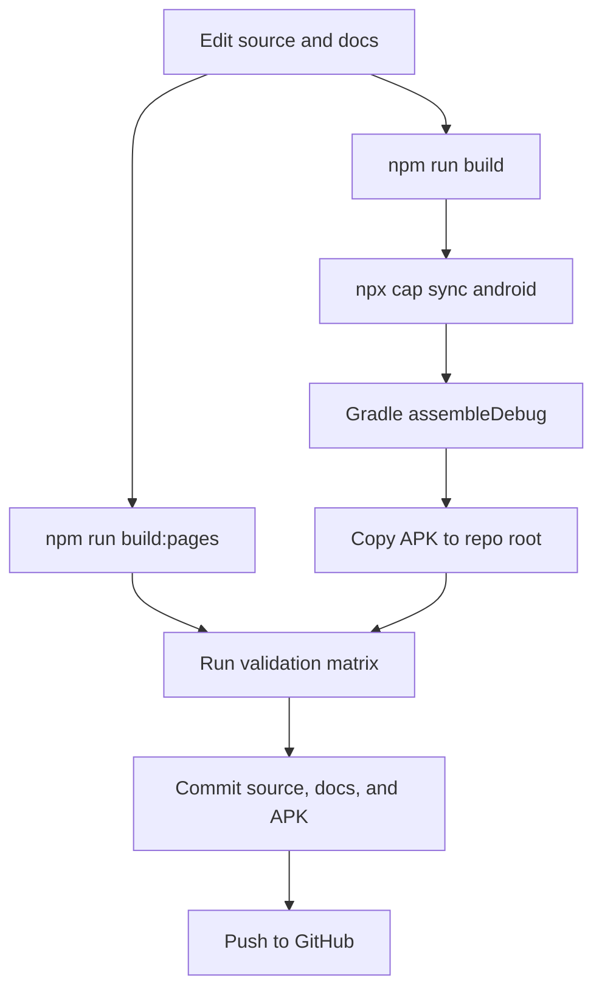

## 15. Validation Process

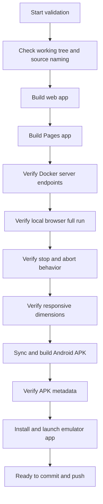

## 16. Validation Matrix

| Area | Scenario | Expected Result | Validation Method |
| --- | --- | --- | --- |
| Source | Repo status before commit | Only intended changes are present | `git status --short` |
| Naming | App uses FTAP name | No old app labels in user-facing files | Source scan |
| Web build | Production build | Angular build succeeds without warnings | `npm run build` |
| Pages build | GitHub Pages build | Angular build succeeds with repo base path | `npm run build:pages` |
| Docker | OpenSpeedTest container | Compose project is running | `docker compose ps` |
| Server download | `/downloading` endpoint | Server returns HTTP 200 | `Invoke-WebRequest` |
| Server upload | `/upload` endpoint | Server accepts POST | `Invoke-WebRequest` |
| Local browser | Full speed test | GO completes and shows download/upload/ping/jitter | Browser automation |
| Stop flow | Stop during active test | App returns to stopped state with clean message | Browser automation |
| Invalid URL | Bad server URL | App rejects URL before network call | Browser automation |
| HTTPS mixed content | Web or GitHub Pages with HTTP URL | App blocks and asks for HTTPS | Code path and validation |
| Responsive small phone | `320x568` completed result | No vertical or horizontal overflow | Playwright metrics |
| Responsive phone | `390x844` completed result | No vertical or horizontal overflow | Playwright metrics |
| Responsive tablet | `768x1024` completed result | No vertical or horizontal overflow | Playwright metrics |
| Responsive desktop | `1366x768` completed result | No vertical or horizontal overflow | Playwright metrics |
| Android sync | Capacitor assets copied | Android web assets updated | `npx cap sync android` |
| APK build | Debug APK generated | Gradle build succeeds | `.\gradlew.bat assembleDebug` |
| APK metadata | App id and label | Package is `com.ftap.openspeedtestpoc` and label is correct | `aapt dump badging` |
| Emulator | APK launch | Main activity is focused | `adb shell monkey` and `dumpsys window` |
| Emulator packaged run | Android WebView to Docker host | Test completes through `http://10.0.2.2:3000` | Emulator tap flow and screenshot |

## 17. Current Validation Run

Validation date: May 6, 2026

| Check | Result | Notes |
| --- | --- | --- |
| Web production build | Passed | `npm run build` completed without warnings after budget update for the larger visual component stylesheet |
| Docker server | Passed | `openspeedtest` container is running on ports `3000` and `3001` |
| OpenSpeedTest download endpoint | Passed | `http://127.0.0.1:3000/downloading?probe=1` returned HTTP 200 |
| OpenSpeedTest upload endpoint | Passed | `http://127.0.0.1:3000/upload?probe=1` accepted POST and returned HTTP 200 |
| Local browser full run | Passed | Local run completed with download, upload, ping, jitter, and result ID |
| Stop/abort flow | Passed | Stop now displays `Speed test stopped.` instead of a low-level abort error |
| Completion state | Passed | Stop button is hidden after completion |
| Invalid URL flow | Passed | `not-a-url` is rejected before any speed-test request starts |
| Responsive small phone | Passed | `320x568` completed result had no document or Ionic inner-scroll overflow |
| Responsive phone | Passed | `390x844` completed result had no document or Ionic inner-scroll overflow |
| Responsive tablet | Passed | `768x1024` completed result had no document or Ionic inner-scroll overflow |
| Responsive desktop | Passed | `1366x768` completed result had no document or Ionic inner-scroll overflow |
| Android sync | Passed | `npx cap sync android` copied the latest web assets |
| Android debug APK build | Passed | `.\gradlew.bat assembleDebug` completed successfully |
| APK metadata | Passed | Package `com.ftap.openspeedtestpoc`, label `FTAP OpenSpeedTest POC`, activity `.MainActivity` |
| APK base href | Passed | `assets/public/index.html` uses `<base href="/">` |
| Emulator install and launch | Passed | `adb install -r` succeeded and `.MainActivity` was focused |
| Emulator packaged run | Passed | APK completed a run through `http://10.0.2.2:3000` after native mixed-content guard was limited to web runtime only |

Future changes should rerun the full build, browser, Android, and emulator matrix before release.

Unit test note: this app currently has no `*.spec.ts` files, so there is no unit-test suite to run. Validation is done through build checks, browser automation, Docker endpoint probes, Android build checks, and emulator checks.

Residual risk: `npm audit` reports moderate vulnerabilities in the Angular CLI development dependency chain. The app runtime bundle is not directly using that package path, `npm audit --audit-level=high` passes in prior validation, and npm currently recommends a force fix path. That force path should be avoided unless the Angular toolchain is deliberately upgraded and retested.

## 18. Edge Cases And Expected Behavior

| Edge Case | Expected Behavior | Why |
| --- | --- | --- |
| Empty server URL | App shows validation error and does not start | Prevents a blank network target |
| Missing protocol | App rejects it | `new URL()` requires a real scheme for reliable behavior |
| Unsupported protocol | App rejects it | Only `http://` and `https://` are valid for this POC |
| URL with trailing slash | App normalizes it | Avoids inconsistent saved values |
| URL with query or hash | App strips query/hash when saving server URL | The app owns runtime query params |
| Docker server stopped | App shows a network/server error | Endpoint requests cannot complete |
| Server missing `/downloading` | Download phase errors | OpenSpeedTest-compatible server must expose the endpoint |
| Server missing `/upload` | Ping or upload phase errors | OpenSpeedTest-compatible server must expose the endpoint |
| Server does not allow CORS | Browser rejects endpoint requests | Web apps need CORS for cross-origin endpoint fetches |
| Emulator uses `127.0.0.1` | Test does not reach Windows Docker | Emulator localhost is isolated from host localhost |
| Emulator uses `10.0.2.2` | Test can reach Windows Docker | Android emulator host alias |
| GitHub Pages uses LAN URL | Remote users cannot access it | Private addresses are not internet routable |
| GitHub Pages uses HTTP URL | App blocks and asks for HTTPS | Avoids mixed-content failure from an HTTPS page |
| Stop during ping | App aborts and shows stopped state | Prevents stale async errors |
| Stop during download stream | App aborts and shows stopped state | Prevents low-level stream abort messages |
| Stop during upload POST | App aborts and shows stopped state | Prevents low-level fetch abort messages |
| Completion after stop | Ignored by abort state | Prevents stopped run from rendering completed results |
| Reload during active run | Reload button is disabled while running | Prevents overlapping tests |
| Restart after complete | Starts a fresh run | Metrics reset before new measurement |
| Saved old LAN URL on Android | App falls back to emulator default if saved value is old LAN default | Avoids previous local default breaking emulator POC |
| Light/dark toggle | Theme persists in local storage | User preference remains across sessions |

## 19. Troubleshooting Decision Tree

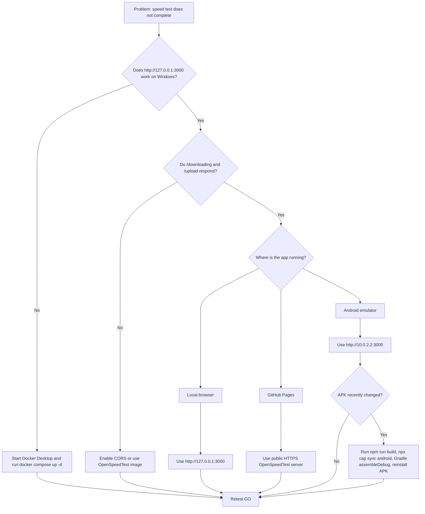

## 20. Common Problems

| Problem | Likely Cause | Fix |
| --- | --- | --- |
| App says invalid URL | Missing `http://` or `https://` | Enter a full URL |
| Local run cannot reach server | Docker server is stopped or wrong port | Run `docker compose up -d` and use `http://127.0.0.1:3000` |
| Emulator cannot reach server | Wrong host address | Use `http://10.0.2.2:3000` |
| Works locally but not on GitHub Pages | Private URL or HTTP URL | Use a public HTTPS OpenSpeedTest server |
| App says HTTPS server is required | The app is served from HTTPS and server URL is HTTP | Put the OpenSpeedTest server behind HTTPS |
| Upload or download phase fails | Missing endpoint or CORS issue | Use the OpenSpeedTest Docker image or configure equivalent endpoints |
| Docker Desktop shows old project name | Old Compose project still running | Run old project down and start current compose file |
| APK installs but old UI appears | Old APK or unsynced Capacitor assets | Rebuild web, sync Capacitor, rebuild APK, reinstall |
| Start appears to do nothing | Old browser bundle or cached app | Hard reload browser or restart dev server |
| GitHub Pages 404 for assets | Wrong Angular base href | Use `npm run build:pages` |

## 21. Security And Production Notes

The POC intentionally allows local HTTP traffic:

```ts
android: {
  allowMixedContent: true,
},
server: {
  cleartext: true,
  allowNavigation: ['*'],
},
```

This is suitable for a local POC. It is not the recommended production posture.

For production:

- Serve OpenSpeedTest over HTTPS.
- Restrict `allowNavigation` to the exact trusted domain.
- Remove broad wildcard navigation.
- Sign a release APK with a release keystore.
- Do not distribute debug APKs.
- Add automated end-to-end tests.
- Add a release pipeline that stores APKs as GitHub release assets instead of manually committing only debug artifacts.

## 22. Known POC Limitations

- Browser-based speed tests are approximate and depend on browser fetch behavior, device load, Docker host load, and network conditions.
- The app currently stores only the latest in-memory result and does not keep history.
- The result ID is a local POC identifier, not a signed public result certificate.
- The APK is a debug artifact.
- Public remote testing requires a public HTTPS OpenSpeedTest-compatible server.
- Local HTTP support is intentionally enabled for the POC.

## 23. Recommended Enhancements

Recommended next steps if this moves beyond POC:

1. Host OpenSpeedTest behind a real domain with HTTPS.
2. Restrict Capacitor navigation to that domain.
3. Add release signing for Android.
4. Add a results history screen.
5. Add E2E tests for URL validation, start, stop, completion, and theme persistence.
6. Add CI jobs for Android APK build artifacts.
7. Add environment-based defaults for local, staging, and production server URLs.
8. Add a server health-check endpoint before starting the full test.

## 24. Command Reference

```bash
npm install
npm start
npm run build
npm run build:pages
npx cap sync android
docker compose up -d
docker compose ps
docker compose logs -f
```

PowerShell Android build:

```powershell
$env:JAVA_HOME='C:\Program Files\Android\Android Studio\jbr'
$env:Path="$env:JAVA_HOME\bin;$env:Path"
Push-Location android
.\gradlew.bat assembleDebug
Pop-Location
Copy-Item -LiteralPath 'android\app\build\outputs\apk\debug\app-debug.apk' -Destination 'FTAP-OpenSpeedTest-POC-debug.apk' -Force
```

Android install and launch:

```powershell
adb install -r FTAP-OpenSpeedTest-POC-debug.apk
adb shell monkey -p com.ftap.openspeedtestpoc -c android.intent.category.LAUNCHER 1
```
