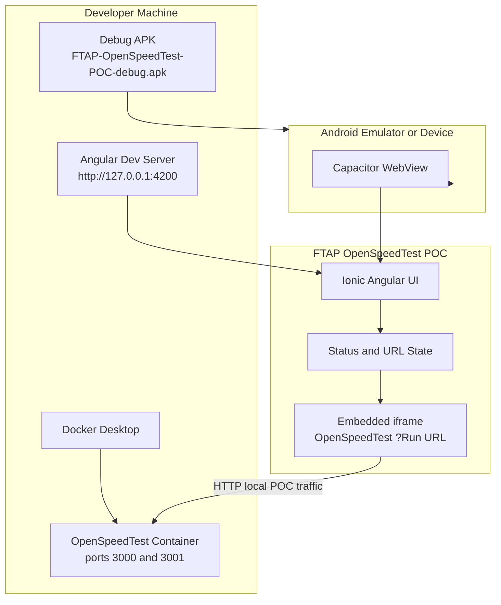
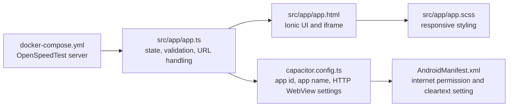
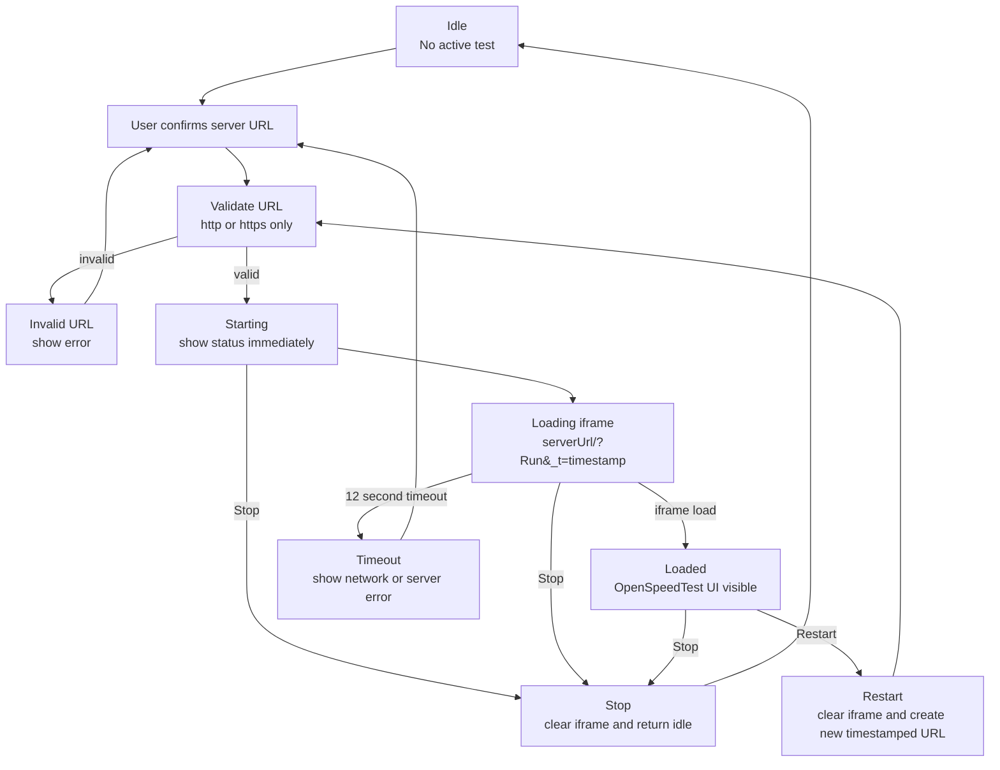
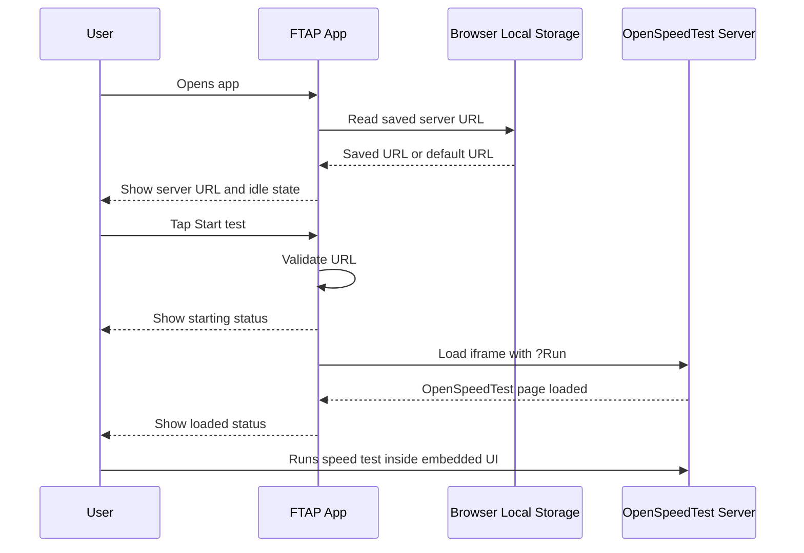
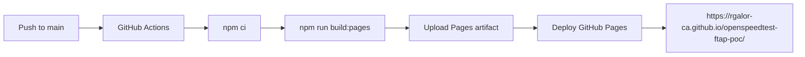
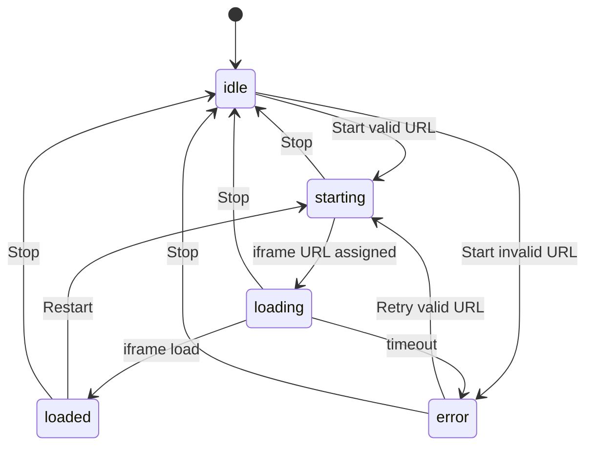
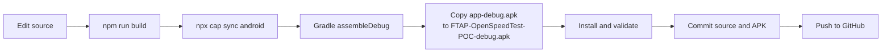

# FTAP OpenSpeedTest POC Documentation

This document explains the FTAP OpenSpeedTest POC architecture, runtime behavior, setup, testing strategy, validation scenarios, edge cases, troubleshooting, and build process.

## 1. Purpose

The purpose of this POC is to provide a hybrid mobile app that can run a basic speed test using the open-source OpenSpeedTest server.

The app does not reimplement the network measurement engine. Instead, it embeds the OpenSpeedTest server page and starts the OpenSpeedTest flow with the `Run` query parameter.

This approach is recommended for the POC because OpenSpeedTest already provides the browser-based download, upload, ping, and jitter test behavior. The mobile app is responsible for:

- Launching the test experience.
- Managing the server URL.
- Showing clear loading and error states.
- Providing a hybrid Android shell.
- Supporting local browser and emulator validation.

## 2. Visual Architecture

### Current Browser Validation Screenshot


This screenshot was captured from the local app at `http://127.0.0.1:4200` after starting the test against the local OpenSpeedTest server on port `3000`.


This screenshot was captured from the installed debug APK running in the Android emulator after loading OpenSpeedTest through `http://10.0.2.2:3000`.

### System Architecture



## 3. Component Responsibilities



| File | Responsibility |
| --- | --- |
| `src/app/app.ts` | URL validation, local storage, app status, iframe URL generation, start/stop/reload behavior |
| `src/app/app.html` | Header, server URL input, buttons, status text, empty/loading states, iframe |
| `src/app/app.scss` | Mobile-first layout, control panel styling, test frame container, status UI |
| `capacitor.config.ts` | Capacitor app id, app display name, web output path, Android cleartext/mixed-content behavior |
| `android/app/src/main/AndroidManifest.xml` | Android internet permission and cleartext traffic support |
| `docker-compose.yml` | Local OpenSpeedTest Docker server |

## 4. Technology Decisions

### Why Ionic Angular

Ionic Angular is suitable for this POC because it provides:

- Mobile UI components.
- Familiar Angular structure.
- Fast local browser iteration.
- Native Android packaging through Capacitor.

### Why Capacitor

Capacitor is used because the target delivery is a hybrid Android APK. Capacitor wraps the Angular app inside an Android WebView while still allowing native build, install, and emulator testing.

### Why OpenSpeedTest Docker

OpenSpeedTest already provides the speed-test server and browser measurement flow. Running it through Docker keeps the POC simple, reproducible, and close to the upstream open-source project.

## 5. Runtime Flow



## 6. User Workflow



## 7. Network URL Rules

| Environment | Server URL |
| --- | --- |
| Local browser on same machine | `http://127.0.0.1:3000` |
| Browser on another device in same LAN | `http://<computer-lan-ip>:3000` |
| Android emulator on same Windows host | `http://10.0.2.2:3000` |
| Physical Android phone on same Wi-Fi | `http://<computer-lan-ip>:3000` |
| GitHub Pages remote access | Public HTTPS OpenSpeedTest server URL |

Important behavior:

- `127.0.0.1` in Chrome on Windows means the Windows host.
- `127.0.0.1` inside the Android emulator means the emulator itself.
- Android emulator uses `10.0.2.2` as an alias to the host machine.
- Physical devices usually need the LAN IP of the computer running Docker.
- GitHub Pages is served over HTTPS, so remote users need an HTTPS OpenSpeedTest server. A private LAN or HTTP-only server will not work reliably from the hosted page.

## GitHub Pages Deployment

The repository includes a GitHub Actions workflow at `.github/workflows/pages.yml`.

Deployment flow:



The Pages build uses:

```bash
npm run build:pages
```

This builds Angular with the required repository base path:

```text
/openspeedtest-ftap-poc/
```

## 8. Android WebView HTTP Handling

Local OpenSpeedTest uses HTTP during POC testing. Android WebView can block local HTTP or mixed-content iframe behavior unless configured.

The POC includes:

```ts
android: {
  allowMixedContent: true,
},
server: {
  cleartext: true,
  allowNavigation: ['*'],
},
```

The Android manifest includes:

```xml
android:usesCleartextTraffic="true"
```

Why this is needed:

- The Capacitor app runs inside a WebView.
- The OpenSpeedTest server is loaded through an HTTP iframe.
- Android can block HTTP content without cleartext/mixed-content settings.

Production recommendation:

- Serve OpenSpeedTest over HTTPS.
- Replace `allowNavigation: ['*']` with a specific trusted domain.
- Remove broad local development allowances.

## 9. Application State Machine



State meanings:

| State | Meaning |
| --- | --- |
| `idle` | No active test is running |
| `starting` | Start was clicked and the app is preparing the iframe URL |
| `loading` | iframe URL is assigned and OpenSpeedTest is loading |
| `loaded` | iframe load event completed and the OpenSpeedTest UI should be visible |
| `error` | URL validation failed or iframe load timed out |

## 10. Validation Matrix

| Scenario | Expected Result | Validation Method |
| --- | --- | --- |
| App builds | Angular build completes | `npm run build` |
| Capacitor sync | Android assets regenerate | `npx cap sync android` |
| APK builds | Debug APK generated | `.\gradlew.bat assembleDebug` |
| Local browser opens app | Browser title and UI show FTAP name | `http://127.0.0.1:4200` |
| OpenSpeedTest server available | Server page responds on port 3000 | `http://127.0.0.1:3000` |
| Valid server URL | Start button enters starting/loading state | UI validation |
| Invalid server URL | App shows validation error | Manual/UI validation |
| Android emulator URL | `10.0.2.2:3000` reaches host Docker server | Emulator validation |
| Stop during start/loading | App returns to idle and ignores late iframe loads | Code guard and UI validation |
| Restart after loaded | App creates a fresh timestamped test URL | UI validation |
| Old branding removed | No old package/name references in source | Source scan |

## 11. Edge Cases Checked

### Invalid URL

Input examples:

```text
not-a-url
ftp://example.com
```

Expected behavior:

- The app rejects the value.
- The app shows an error message.
- The iframe is not started.

### Empty URL

Expected behavior:

- The app rejects the value.
- The app does not attempt to load the iframe.

### HTTP Server Not Running

Expected behavior:

- The app enters loading state.
- If the iframe does not finish loading within the timeout window, the app shows an error.

### Android Emulator Uses Wrong URL

Example wrong value:

```text
http://127.0.0.1:3000
```

Expected behavior:

- The emulator cannot reach the Windows host through `127.0.0.1`.
- Use `http://10.0.2.2:3000` instead.

### Stop During Loading

Expected behavior:

- Stop is enabled while a test is starting or loading.
- The app clears the iframe URL.
- Late iframe load events are ignored.

### Restart After Loaded

Expected behavior:

- A new timestamp is added to the OpenSpeedTest URL.
- Browser/WebView cache is bypassed.
- The iframe reloads a fresh test.

### Saved Server URL

Expected behavior:

- Saved URL persists in local storage.
- Android defaults to `10.0.2.2:3000` when the old LAN default is missing or still saved.

## 12. Build And Release Process



## 13. Step-By-Step Local Setup

1. Install dependencies.

```bash
npm install
```

2. Start OpenSpeedTest.

```bash
docker compose up -d
```

3. Start Angular.

```bash
npm start
```

4. Open the local app.

```text
http://127.0.0.1:4200
```

5. Use the proper server URL.

```text
Local Chrome:      http://127.0.0.1:3000
Android emulator: http://10.0.2.2:3000
Physical phone:   http://<host-lan-ip>:3000
```

6. Tap Start test.

7. Confirm the status changes from starting to loading to loaded.

8. Run the OpenSpeedTest test inside the embedded frame.

## 14. Step-By-Step APK Build

1. Build web assets.

```bash
npm run build
```

2. Sync Capacitor.

```bash
npx cap sync android
```

3. Build debug APK.

```powershell
$env:JAVA_HOME='C:\Program Files\Android\Android Studio\jbr'
$env:Path="$env:JAVA_HOME\bin;$env:Path"
Push-Location android
.\gradlew.bat assembleDebug
Pop-Location
```

4. Copy the APK to the repository root.

```powershell
Copy-Item -LiteralPath 'android\app\build\outputs\apk\debug\app-debug.apk' -Destination 'FTAP-OpenSpeedTest-POC-debug.apk' -Force
```

## 15. Install APK On Emulator

```powershell
adb install -r FTAP-OpenSpeedTest-POC-debug.apk
adb shell monkey -p com.ftap.openspeedtestpoc -c android.intent.category.LAUNCHER 1
```

If the app opens but the speed-test panel is blank:

1. Confirm Docker is running.
2. Confirm `http://127.0.0.1:3000` opens on Windows.
3. Confirm the emulator app uses `http://10.0.2.2:3000`.
4. Rebuild after Capacitor config changes.
5. Reinstall the APK.

## 16. Troubleshooting

| Problem | Likely Cause | Fix |
| --- | --- | --- |
| Blank speed-test panel on emulator | Android WebView cannot reach or render HTTP iframe | Use `10.0.2.2:3000`, confirm cleartext settings, rebuild APK |
| Works in browser but not emulator | Wrong host URL inside emulator | Replace `127.0.0.1` with `10.0.2.2` |
| App says invalid URL | Missing protocol or unsupported protocol | Use `http://` or `https://` |
| Start does not visibly change state | Old build or browser cache | Rebuild, reload, confirm title and status text |
| APK installs but old name appears | Old APK still installed | Uninstall or clear app, then install new APK |
| Docker server unreachable | Container not running or port conflict | Run `docker compose ps`, restart Docker container |

## 17. Security Notes

This POC intentionally allows local HTTP traffic so the emulator and LAN testing workflow is simple.

Before production use:

- Use HTTPS.
- Restrict allowed navigation to the trusted speed-test domain.
- Remove broad `allowNavigation: ['*']`.
- Do not commit production secrets.
- Sign release APKs with a release keystore.
- Replace debug APK distribution with a release artifact process.

## 18. Known POC Limitations

- The OpenSpeedTest UI runs inside an iframe.
- The mobile app does not parse or store speed results.
- The POC does not include authentication.
- The included APK is a debug APK, not a production release build.
- The local HTTP setup is for development and demonstration only.

## 19. Recommended Next Enhancements

- Add a native results screen if the team wants controlled FTAP-branded result history.
- Add environment-based server URL configuration.
- Add HTTPS support for non-local testing.
- Add release signing and CI build workflow.
- Add automated end-to-end tests for Start, Stop, invalid URL, and emulator URL scenarios.
