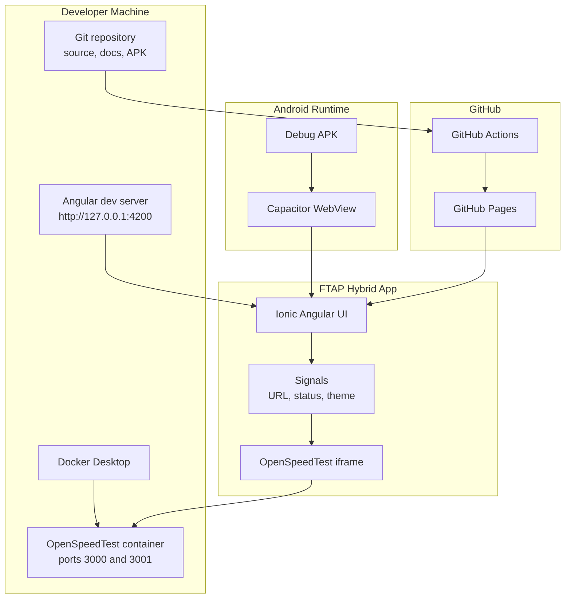
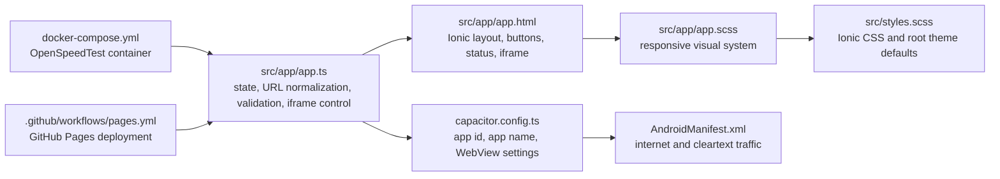
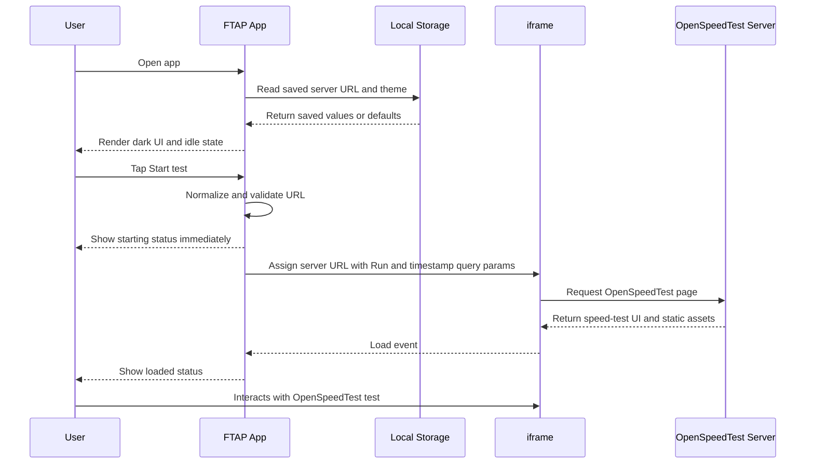
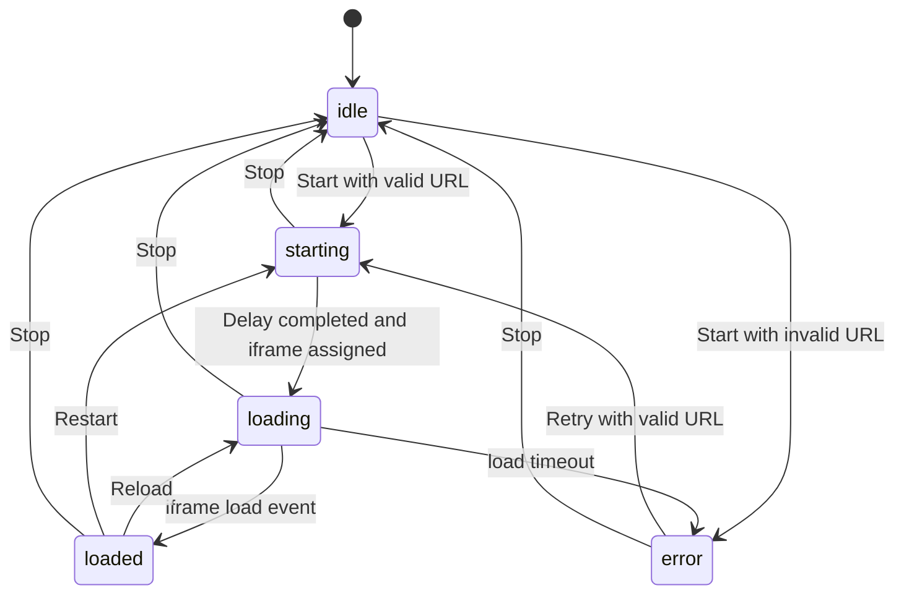
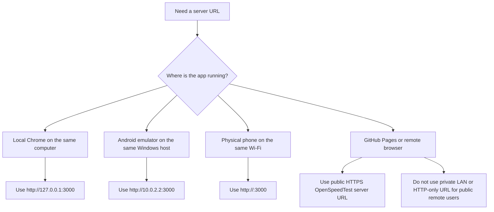
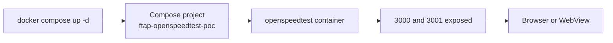
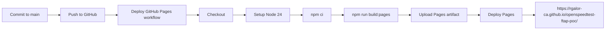
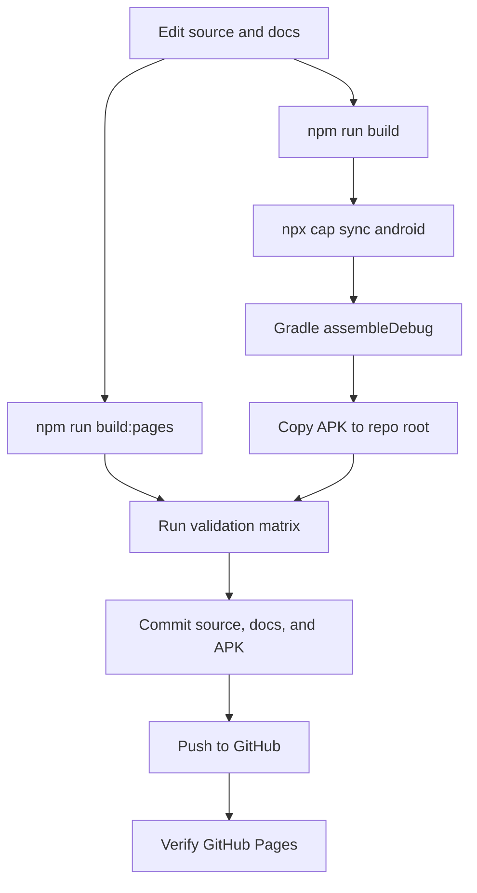
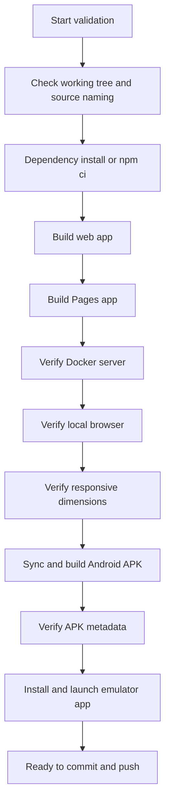
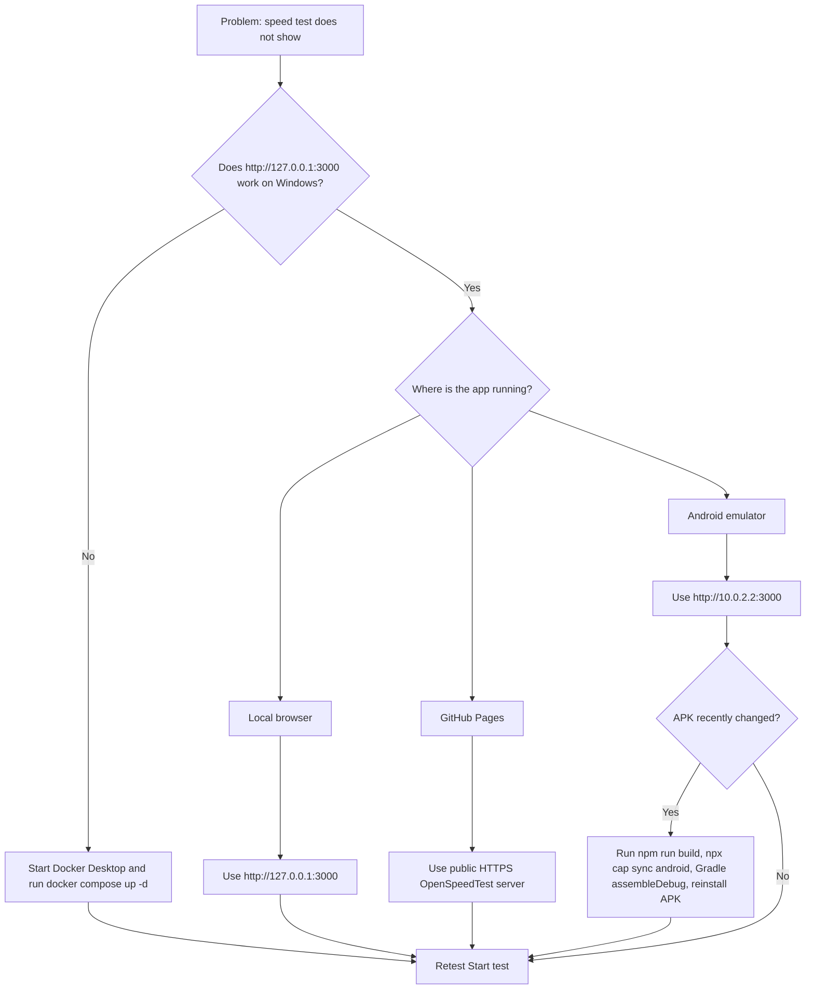

# FTAP OpenSpeedTest POC Documentation

This document is the detailed technical guide for the FTAP OpenSpeedTest POC. It explains the architecture, setup, runtime behavior, build process, deployment flow, validation strategy, edge cases, troubleshooting, and production considerations.

## 1. Project Purpose

FTAP OpenSpeedTest POC is a hybrid mobile proof of concept for running a basic speed test through an open-source OpenSpeedTest server.

The app does not reimplement packet measurement, upload/download measurement, ping, or jitter calculation. OpenSpeedTest already provides the browser-based speed-test engine. The FTAP app provides:

- A branded FTAP mobile shell.
- A native Android package through Capacitor.
- A local browser development workflow.
- A Docker-based OpenSpeedTest server workflow.
- A hosted GitHub Pages shell for remote access.
- Server URL management.
- Immediate and visible app status feedback.
- Dark and light mode.
- One-screen responsive UI with no app-level scrolling across validated viewports.

The upstream reference is:

[https://github.com/openspeedtest/Speed-Test](https://github.com/openspeedtest/Speed-Test)

This is not an Ookla product. The correct product name in this repository is `FTAP OpenSpeedTest POC`.

## 2. Current Visuals

### Local Browser Screenshot


### Android Emulator Screenshot


## 3. System Context



## 4. Component Architecture



| File | Responsibility |
| --- | --- |
| `src/app/app.ts` | Holds app state, URL validation, saved server URL, theme mode, start/stop/reload behavior, iframe URL creation |
| `src/app/app.html` | Defines the Ionic UI, toolbar, server input, action buttons, status row, empty state, loading overlay, and iframe |
| `src/app/app.scss` | Provides dark/light themes, one-screen responsive layout, button sizing, panel sizing, and iframe shell styling |
| `src/styles.scss` | Imports Ionic CSS and defines baseline root styling |
| `capacitor.config.ts` | Defines Capacitor app id/name, web output path, and local HTTP WebView settings |
| `android/app/src/main/AndroidManifest.xml` | Enables internet permission and cleartext traffic for local HTTP POC testing |
| `docker-compose.yml` | Runs the local OpenSpeedTest server and names the Docker stack `ftap-openspeedtest-poc` |
| `.github/workflows/pages.yml` | Builds and deploys the static web app to GitHub Pages |

## 5. Runtime Flow



## 6. App State Machine



| State | User-Facing Meaning |
| --- | --- |
| `idle` | No test is active |
| `starting` | The user clicked Start and the app is preparing the iframe |
| `loading` | The iframe is loading OpenSpeedTest |
| `loaded` | The iframe load event completed and the test UI should be visible |
| `error` | URL validation failed or the server did not finish loading in time |

## 7. URL Decision Tree



## 8. Network Rules

| Runtime | Correct URL | Why |
| --- | --- | --- |
| Windows Chrome, Docker on same Windows host | `http://127.0.0.1:3000` | Chrome resolves localhost to Windows |
| Android emulator, Docker on Windows host | `http://10.0.2.2:3000` | Android emulator maps `10.0.2.2` to the host machine |
| Physical Android phone, Docker on Windows host | `http://<host-lan-ip>:3000` | The phone is a separate LAN device |
| GitHub Pages | Public HTTPS URL | Pages is HTTPS and remote users cannot reach private LAN hosts |

Incorrect examples:

| URL | Problem |
| --- | --- |
| `127.0.0.1:3000` | Missing protocol |
| `ftp://example.com` | Unsupported protocol |
| `http://127.0.0.1:3000` in emulator | Points to the emulator, not Windows |
| `http://192.168.x.x:3000` from a remote public user | Private LAN address is not reachable from the internet |
| `http://public-server.example.com` from GitHub Pages | May be blocked as mixed content because Pages is HTTPS |

## 9. Docker Server Flow



Docker Compose:

```yaml
name: ftap-openspeedtest-poc

services:
  openspeedtest:
    image: openspeedtest/latest
    container_name: openspeedtest
    restart: unless-stopped
    ports:
      - '3000:3000'
      - '3001:3001'
```

Validate:

```bash
docker compose ps
```

Expected project name:

```text
ftap-openspeedtest-poc
```

Expected local server:

```text
http://127.0.0.1:3000/
```

## 10. GitHub Pages Deployment Flow



Why `build:pages` exists:

GitHub Pages hosts the app under the repository path:

```text
/openspeedtest-ftap-poc/
```

The Pages build sets this base path so Angular assets resolve correctly:

```bash
npm run build:pages
```

## 11. Local Development Setup

1. Install dependencies.

```bash
npm install
```

2. Start Docker Desktop.

3. Start the OpenSpeedTest server.

```bash
docker compose up -d
```

4. Validate Docker.

```bash
docker compose ps
```

5. Validate OpenSpeedTest.

```text
http://127.0.0.1:3000/
```

6. Start the Angular dev server.

```bash
npm start
```

7. Open the local app.

```text
http://127.0.0.1:4200/
```

8. In local Chrome, use:

```text
http://127.0.0.1:3000
```

9. Tap Start test.

10. Confirm the status changes from idle to starting, loading, and loaded.

## 12. Android Emulator Setup

1. Build web assets.

```bash
npm run build
```

2. Sync Capacitor.

```bash
npx cap sync android
```

3. Build the APK.

```powershell
$env:JAVA_HOME='C:\Program Files\Android\Android Studio\jbr'
$env:Path="$env:JAVA_HOME\bin;$env:Path"
Push-Location android
.\gradlew.bat assembleDebug
Pop-Location
```

4. Copy the debug APK to the repository root.

```powershell
Copy-Item -LiteralPath 'android\app\build\outputs\apk\debug\app-debug.apk' -Destination 'FTAP-OpenSpeedTest-POC-debug.apk' -Force
```

5. Install and launch.

```powershell
adb install -r FTAP-OpenSpeedTest-POC-debug.apk
adb shell monkey -p com.ftap.openspeedtestpoc -c android.intent.category.LAUNCHER 1
```

6. In the app, use:

```text
http://10.0.2.2:3000
```

## 13. Build And Release Process



## 14. Validation Process



## 15. Validation Matrix

| Area | Scenario | Expected Result | Validation Method |
| --- | --- | --- | --- |
| Source | Repo clean before work | No unknown unrelated changes | `git status --short` |
| Naming | App uses FTAP name | No old POC names in user-facing files | Source scan |
| Dependencies | Dependencies install | npm completes without fatal errors | `npm install` or `npm ci` |
| Web build | Production build | Angular build succeeds | `npm run build` |
| Pages build | GitHub Pages build | Angular build succeeds with repo base path | `npm run build:pages` |
| Docker | OpenSpeedTest container | Compose project is running | `docker compose ps` |
| Server | OpenSpeedTest HTTP response | Server returns HTTP 200 | `http://127.0.0.1:3000/` |
| Local app | Angular dev server | App returns HTTP 200 | `http://127.0.0.1:4200/` |
| Responsive | Small phone | No app-level scroll, no horizontal overflow | Chrome device metrics `320x568` |
| Responsive | Mobile | No app-level scroll, controls fit | Chrome device metrics `390x844` |
| Responsive | Tablet | Layout uses available space cleanly | Chrome device metrics `768x1024` |
| Responsive | Desktop | One-screen layout remains centered | Chrome device metrics `1366x768` |
| Android sync | Capacitor assets copied | Android web assets updated | `npx cap sync android` |
| APK build | Debug APK generated | Gradle build succeeds | `.\gradlew.bat assembleDebug` |
| APK metadata | App id and label | Package is `com.ftap.openspeedtestpoc` and label is correct | `aapt dump badging` |
| Emulator | APK launch | Main activity is focused | `adb shell monkey` and `dumpsys window` |
| GitHub Pages | Hosted app | Hosted URL returns HTTP 200 | `Invoke-WebRequest` |

## 16. Current Validation Run

Validation date: May 6, 2026

| Check | Result | Notes |
| --- | --- | --- |
| Remote sync | Passed | Local `main` and `origin/main` were aligned before changes |
| Source branding scan | Passed | No tracked source/doc leftovers for old names such as `come-up-with-mobile-app-na` or old package ids |
| Markdown/check diff hygiene | Passed | `git diff --check` passed, only line-ending warnings from Windows |
| Dependency install | Passed | `npm ci` completed |
| Security audit gate | Passed with residual moderate dev advisory | `npm audit --audit-level=high` returned success; npm still reports moderate dev-tool advisories through Angular CLI dependency chain |
| Web production build | Passed | `npm run build` completed |
| GitHub Pages build | Passed | `npm run build:pages` completed |
| Docker server | Passed | `docker compose ps` showed `openspeedtest` running |
| OpenSpeedTest server response | Passed | `http://127.0.0.1:3000/` returned HTTP 200 |
| Local Angular app response | Passed | `http://127.0.0.1:4200/` returned HTTP 200 |
| Browser valid start flow | Passed | `http://127.0.0.1:3000` reached `Speed test loaded` with one iframe |
| Browser invalid URL flow | Passed | `not-a-url` was rejected and no iframe was created |
| Theme persistence | Passed | Saved light mode persisted across reload and start flow |
| Responsive phone | Passed | `320x568` viewport had no document or Ionic inner-scroll overflow |
| Responsive mobile | Passed | `390x844` viewport had no document or Ionic inner-scroll overflow |
| Responsive tablet | Passed | `768x1024` viewport had no document or Ionic inner-scroll overflow |
| Responsive desktop | Passed | `1366x768` viewport had no document or Ionic inner-scroll overflow |
| Capacitor sync | Passed | `npx cap sync android` completed |
| Android debug APK build | Passed | `.\gradlew.bat assembleDebug` completed |
| APK metadata | Passed | Package id `com.ftap.openspeedtestpoc`, label `FTAP OpenSpeedTest POC`, launch activity `.MainActivity` |
| APK base href | Passed | APK `assets/public/index.html` uses `<base href="/">` |
| Emulator install | Passed | `adb install -r FTAP-OpenSpeedTest-POC-debug.apk` completed |
| Emulator launch | Passed | Focused activity was `com.ftap.openspeedtestpoc/.MainActivity` |
| Emulator speed-test load | Passed | APK loaded OpenSpeedTest through `http://10.0.2.2:3000` and screenshot was refreshed |

Unit test note: this app currently has no `*.spec.ts` files, so there is no unit-test suite to run. The validation above covers the implemented POC behavior through build, browser automation, Docker, Android APK, and emulator checks.

Residual risk: `npm audit` reports moderate vulnerabilities in the Angular CLI development dependency chain. The app runtime bundle is not directly using that package path, `npm audit --audit-level=high` passes, and npm currently recommends a force fix path. That force path was not applied because it can destabilize the Angular toolchain without a clear runtime benefit for this POC.

## 17. Edge Cases And Expected Behavior

| Edge Case | Expected Behavior | Why |
| --- | --- | --- |
| Empty server URL | App shows validation error and does not set iframe URL | Prevents a blank iframe request |
| Missing protocol | App rejects it | `new URL()` requires a real scheme for reliable behavior |
| Unsupported protocol | App rejects it | Only `http://` and `https://` are valid for WebView/browser iframe use |
| URL with trailing slash | App normalizes it | Avoids inconsistent saved values |
| URL with query or hash | App strips query/hash when saving server URL | The app owns runtime query params like `Run` and `_t` |
| Docker server stopped | App eventually shows load failure | The iframe cannot load the OpenSpeedTest server |
| Emulator uses `127.0.0.1` | Test does not reach Windows Docker | Emulator localhost is isolated from host localhost |
| Emulator uses `10.0.2.2` | Test can reach Windows Docker | Android emulator host alias |
| GitHub Pages uses LAN URL | Remote users cannot access it | Private addresses are not internet routable |
| GitHub Pages uses HTTP URL | Browser may block mixed content | Pages is HTTPS |
| Stop while starting | App clears pending status transition | Prevents delayed iframe assignment |
| Stop while loading | App clears iframe and load timeout | Avoids stale load state |
| Late iframe load after stop | App ignores it | `onTestFrameLoad` checks current state |
| Restart after loaded | App generates a fresh timestamp URL | Avoids cached iframe state |
| Reload button with no active URL | App does nothing | Avoids invalid URL parsing |
| Saved old LAN URL on Android | App falls back to emulator default if saved value is old LAN default | Avoids previous local default breaking emulator POC |
| Light/dark toggle | Theme persists in local storage | User preference remains across sessions |

## 18. Troubleshooting Decision Tree



## 19. Common Problems

| Problem | Likely Cause | Fix |
| --- | --- | --- |
| App says invalid URL | Missing `http://` or `https://` | Enter a full URL |
| Blank or empty test frame in emulator | Wrong server URL | Use `http://10.0.2.2:3000` |
| Works locally but not on GitHub Pages | Private URL or mixed content | Use a public HTTPS OpenSpeedTest server |
| Docker Desktop shows old project name | Old Compose project still running | Run old project down and start current compose file |
| APK installs but old UI appears | Old APK or unsynced Capacitor assets | Rebuild web, sync Capacitor, rebuild APK, reinstall |
| Start appears to do nothing | Old browser bundle or cached app | Hard reload browser or restart dev server |
| GitHub Pages 404 for assets | Wrong Angular base href | Use `npm run build:pages` |
| Android HTTP blocked | Cleartext or mixed content not enabled | Keep POC settings or move to HTTPS |

## 20. Security And Production Notes

The POC intentionally allows local HTTP traffic:

```ts
android: {
  allowMixedContent: true,
},
server: {
  cleartext: true,
  allowNavigation: ['*'],
},
```

This is suitable for a local POC. It is not the recommended production posture.

For production:

- Serve OpenSpeedTest over HTTPS.
- Restrict `allowNavigation` to the exact trusted domain.
- Remove broad wildcard navigation.
- Sign a release APK with a release keystore.
- Do not distribute debug APKs.
- Add automated end-to-end tests.
- Add a release pipeline that stores APKs as GitHub release assets instead of manually committing only debug artifacts.

## 21. Known POC Limitations

- The speed-test engine is embedded as an iframe.
- The app does not store speed-test history.
- The app does not parse detailed OpenSpeedTest results into native FTAP screens.
- The APK is a debug artifact.
- Public remote testing requires a public HTTPS OpenSpeedTest server.
- Local HTTP support is intentionally enabled for the POC.

## 22. Recommended Enhancements

Recommended next steps if this moves beyond POC:

1. Host OpenSpeedTest behind a real domain with HTTPS.
2. Restrict Capacitor navigation to that domain.
3. Add release signing for Android.
4. Add a results capture flow if FTAP needs branded result history.
5. Add E2E tests for URL validation, start, stop, restart, and theme persistence.
6. Add CI jobs for Android APK build artifacts.
7. Add environment-based defaults for local, staging, and production server URLs.

## 23. Command Reference

```bash
npm install
npm start
npm run build
npm run build:pages
npx cap sync android
docker compose up -d
docker compose ps
docker compose logs -f
```

PowerShell Android build:

```powershell
$env:JAVA_HOME='C:\Program Files\Android\Android Studio\jbr'
$env:Path="$env:JAVA_HOME\bin;$env:Path"
Push-Location android
.\gradlew.bat assembleDebug
Pop-Location
Copy-Item -LiteralPath 'android\app\build\outputs\apk\debug\app-debug.apk' -Destination 'FTAP-OpenSpeedTest-POC-debug.apk' -Force
```

Android install and launch:

```powershell
adb install -r FTAP-OpenSpeedTest-POC-debug.apk
adb shell monkey -p com.ftap.openspeedtestpoc -c android.intent.category.LAUNCHER 1
```
